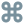

# zmk-config
This config is based on [urob's](https://github.com/urob/zmk-config) config.

## keymap
 _(keymap image generated by [caksoylar/keymap-drawer](https://github.com/caksoylar/keymap-drawer))_

Behavior legend

| Symbol | Description                                         | Symbol | Description                                               |
| :----: | --------------------------------------------------- | :----: | --------------------------------------------------------- |
|  | [Smart Word behavior](#smart-word-behaviors) |  | [Exit layer/behavior](#exiting-smart-word-behaviors) |
|  | sticky key |  | No binding |

### Base

Legend

| Symbol | Description                                         | Symbol | Description                                               |
| :----: | --------------------------------------------------- | :----: | --------------------------------------------------------- |
|  | backspace |  | delete |
|  | return |  | space |
|  | Tab | | |
|  | caps word (double tap) |  | repeat character (tap) |
|  | num_word | | |
|  | leader |  | Mouse layer |

[//]: # ( MEH)

[//]: # (

)

### Num

### Nav

Legend

| Symbol | Description                                         | Symbol | Description                                               |
| :----: | --------------------------------------------------- | :----: | --------------------------------------------------------- |
|  | swapper |  | Shift-Tab |
|  | down arrow |  | up arrow |
|  | left arrow |  | right arrow |
|  | Start of document |  | End of document |
|  | Start of line |  | End of line |
|  | Page Down |  | Page Up |

### Mouse

Holding the [Nav](#nav) layer key will increase mouse movement speed. Holding the [Fn](#fn) layer key with slow mouse movement speed.

Legend

| Symbol | Description                                         | Symbol | Description                                               |
| :----: | --------------------------------------------------- | :----: | --------------------------------------------------------- |
|  | mouse up |  | mouse down |
|  | mouse left |  | mouse right |
|  | mouse left click |  | mouse right click
|  | mouse middle click | | | |
|  | mouse scroll down |  | mouse scroll up
|  | mouse scroll left |  | mouse scroll right
|  | Page Down |  | Page Up |

### Fn

Legend

| Symbol | Description                                         | Symbol | Description                                               |
| :----: | --------------------------------------------------- | :----: | --------------------------------------------------------- |
|  | window manager | | | |
|  | next desktop |  | previous desktop |

[//]: # (

)

### Sys

Legend

| Symbol | Description                                         | Symbol | Description                                               |
| :----: | --------------------------------------------------- | :----: | --------------------------------------------------------- |
|  | bluetooth connection |  | bluetooth clear |
|  | reset |  | boot loader |

## Behavior

### Smart Word Behaviors

Smart word behavior perform an action for which you would normally `hold` a key,
but only require you to `tap` it at the beginning of a sequence to "enter" that special mode, and
you remain in that mode until you press a key not in the defined "continue-list" (a "break-word" key,
like **␣** [space]), **_or_** until you explicitly "exit" that mode.

The most common example of this type of behavior is [ZMK's `&caps_word`](https://zmk.dev/docs/behaviors/caps-word).

Smart word behaviors are marked with the  symbol.

#### Exiting Smart Word Behaviors

Sometimes you may enter a smart behavior by accident, or may need to cancel it to accommodate special
use cases. For these situations there are special "cancel" keys, marked with an .
