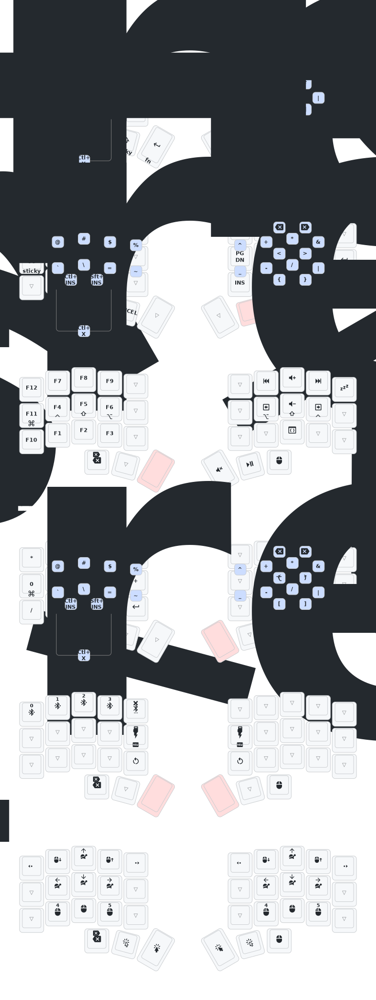
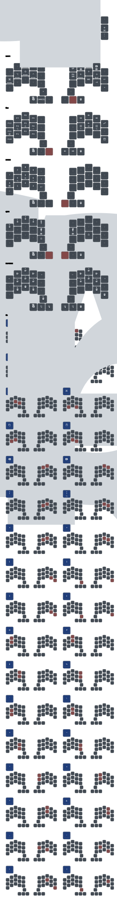

# zmk-config

  
wireless corne 36 keymap

  

  _(keymap image generated by [caksoylar/keymap-drawer](https://github.com/caksoylar/keymap-drawer))_

  
wireless draculad keymap

  

  _(keymap image generated by [caksoylar/keymap-drawer](https://github.com/caksoylar/keymap-drawer))_

